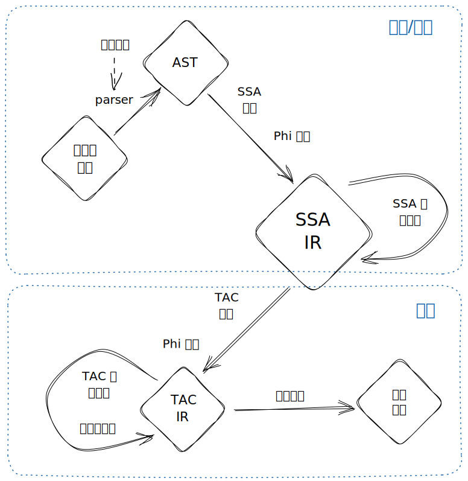
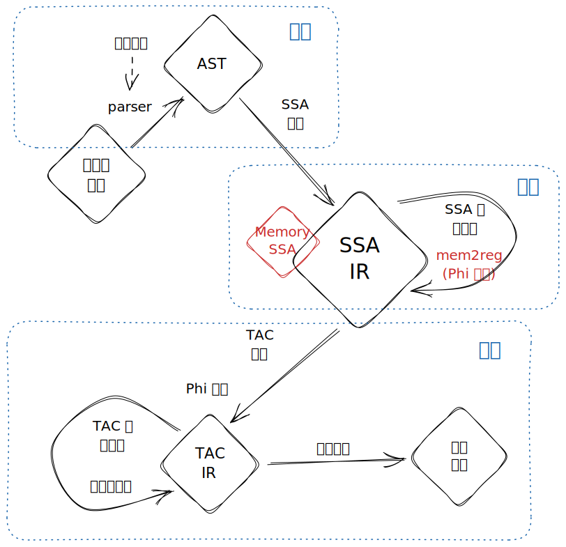

public:: true

- 项目本体相关的 TODO
	- 考虑统一主语的意义? 目前本页面中的 "我" 均指 HITsz 2022 年参赛的萝杨空队 #TODO
- 总览
	- 做什么
	  collapsed:: true
		- SysY -> ARMv7
		- 源语言特性: (2022)
		  collapsed:: true
			- int/float 两种类型
			- 加减乘除模运算表达式
			- 分离的比较表达式
				- 比较只能在控制结构的条件里用, 不能嵌入到普通表达式中
				- 要做短路
			- 表达式里对 int 和 float 采取相同的 op, 需要做合理的类型推断和隐式转换的插入
			- if 和 while 控制结构
			- 函数
				- 会调用外部函数
					- 外部函数作为静态链接库被链接
					- 基本上是 IO 函数
				- 不会被外部函数调用
			- 数组
				- 数组会作为函数 (包括一些外部函数) 的参数被传递, 此时会退化为指针
				- 语言中没有指针的概念
				- 有全局数组和局部数组 (栈上的)
				- 数组初始化器语法处理起来很烦
		- 目标语言特性:
		  collapsed:: true
			- 相对比较精简的指令集
			- 整数和跳转和调用约定可以参考我的博客
			- 完整的对汇编的理解可以参考这本书
			- SIMD 和向量化的使用 #TODO
	- 怎么做 (比赛/赛程相关)
	  collapsed:: true
		- (可选) 加群: HITsz 毕昇杯招新群
		- 找队友
		  collapsed:: true
			- 推荐配置: 2-3 人
			- 优秀要求:
				- 熟悉 git, 知道 add/commit/push/pull/merge/rebase
				- 熟悉 Linux 操作, 能写点小脚本
				- 熟悉 C++, 不害怕巨大项目
					- 如果是预计使用 Java 开发的话, 还要熟悉 Java
					- C++ 必须会看, 因为 LLVM 将会是主要的参考对象
					- C++ 14 或以上, Java 15
				- 知道多趟编译器的基本架构和想要使用的 IR 的描述
			- 基本要求:
				- 至少有一个人会使用 git 解决冲突, 其他人都会 git add/commit/push/pull
				  :LOGBOOK:
				  CLOCK: [2023-01-03 Tue 17:58:55]--[2023-01-03 Tue 17:58:55] =>  00:00:00
				  :END:
				- 至少有一个人会用 qemu 和 gdb-remote, 或者有一个人能配一个 CI
				- 至少有一个人熟悉 C++, 其他人学过 C++/Java, 能写一百行以内的小程序
				- 至少有一个人跟过一些编译器的教程做过真的编译器
					- 源语言多大多小无所谓, 特性应该也无所谓, 图灵完备就行
					- 学校 2022 年的编译原理实验在看懂框架代码的基础上只能非常勉强地符合这个要求
						- 但是做过的人至少可以被另一个会的人快速教导
					- 只做过解释器应该是不够的
					- 只做过编译到某个 VM 的 bytecode 上面的编译器的话, 后端部分可能要折磨一点
			- 分工推荐:
				- 1 人:
					- 能进复赛就是成功
						- 除非您有丰富的编译器相关经验, 否则一人干活能进复赛就是很强的了
						- 想要拼二等奖都比较难
					- 如果您如此地强, 可以试试玩点花活
					- 如果您比较想要拿个奖
						- 推荐直接使用 TAC IR, 这样前端和后端都比较方便
						- 优化上做点常数折叠和到达定值分析时间应该就差不多了
				- 2 人:
					- 前端: 负责源代码 -> IR 及其优化
					- 后端: 负责 IR -> 汇编及其优化
					- 两个人在开始的一个月里要密切沟通, 把 IR 和基建做出来
				- 3 人:
					- 前端: 负责源代码 -> IR 及其优化
					- 优化: 负责 IR 上的优化和基建
					- 后端: 负责 IR -> 汇编及其优化
					- 强的话前期可以把自动向量化的基建做了, 后期让优化手负责自动向量化
				- 4 人: 暂时没见过, 不清楚
		- 报名参赛
		  collapsed:: true
			- **提前想好一个炫酷的队名!**
			- 每年大概暑假之前会要求报名
			- 想参赛记得跟老师说说, 要指导教师的
			- 报名需要各个队员的信息和指导老师
				- 信息填个 excel 表
				- 要学生证/饭卡和指导教师工作证扫描
				- 需要一个快递地址来收组委会送的树莓派
			- ~~隐藏信息~~
				- 组委会也有拖延症, 如果你什么东西填错了, 其实过了网页上的 DDL 很久之后也都可以改, 比赛大群里说就可以了; 同理, 如果你过了 DDL 才吸收队员/决定报名参赛什么的, 大群里说说说不定也能报上
				- 不过还是早点准备好比较好吧
		- 写代码
		  collapsed:: true
			- 这个应该在报名参赛之前就开始写!
			- 越早开始越好
			- 什么? 你说理论学习? 在你知道毕昇杯的时候就应该开始学!
				- 当然, 参赛过程中可以开始大量学习, 但是不能是太基础的那种东西
				- 我在参赛的时候学了:
					- LLVM IR 的内存形式和代码结构
					- SSA 上的优化的实现
					- SSA 生成相关的一些资料和论文
					- 如果你要做自动向量化的话, 这时候应该看一些论文什么的来实现特定的策略
		- 收到树莓派
		  collapsed:: true
			- 可以开始搭建 CI 或者测试环境什么的
			- 不过还是本地 qemu 比较方便
		- 官方评测机上线
		  collapsed:: true
			- 这个时候开发进度应该到本地能跑通全部功能样例了
			- 我们这时候有些性能样例还只能编译过, 运行完全 TLE
			- 赶紧看看评测命令和要求
			- 如果开发不是在官方 gitlab 上的, 迁移之
			- 尽快成功运行第一次
			- 据说 21 年的时候评测机很卡, 但是 22 年的感觉还行, 大概半小时能出一次结果
		- 初赛截止
		  collapsed:: true
			- 这时候应该差不多都做完了才行 (所有公开性能样例都能跑出时间, 相对较快)
			- 后面的时间最多补几个小优化 + 进行一些针对样例的优化
			- 可以开始脑子里准备一下答辩 PPT 了
		- 复赛截止
		  collapsed:: true
			- 开始做答辩 PPT 吧
		- 答辩完成
		- 出分出榜
	- 为什么要参赛?
	  collapsed:: true
		- 2022 - 萝杨空队 - 梁韬
			- 最初想要参赛, 主要是想做一个正儿八经的从头到尾的编译器
			- 之前有做过一些解释器, 有看过很多编译方面的书, 但是没有做过正经的编译器
			- 学了一些 PL 和类型论方面的东西, 感到基础不牢固了, 需要做一个编译器来更好地理解各类语言和语言上的构造以及设施
			- 并不是很专注于拿奖
				- 如果以拿奖为目标的的话, 我应该再晚一年参赛的, 这样把握比较大, 时间也比较充裕
			- 不后悔在当时参加了这场比赛
				- 虽然可能我那时能力有限, 没能做出向量化之类的东西
				- 但是我也得以深入地理解了编译器的流程, 得以熟悉了 LLVM 的冰山一角
				- 对我后面的职业规划和作为编译领域的程序的职业发展产生了巨大影响
	- 参赛完了能做什么?
	  collapsed:: true
		- 拿奖了就有华为绿卡
			- 不过好像职位看起来并不是很好就是了 (
		- 更深入地学习 LLVM, 开始尝试给 LLVM 共享代码
			- 广告: PLCT 提供一些编译器相关领域的远程实习岗位
			- 字节之类的大厂有一些编译领域相关的岗位, 可以关注一下
		- 来贡献本文档 :)
- 编译器结构总览
	- 2022 萝杨空队
		- 我们到比赛完结之后的结构
		- 
		- 如果能让我重新设计, 我会把它变成这样:
		- 
		- 我要在 SSA 构建的时候大量使用 Load/Store, 后期再一起做 mem2reg (因为反正不管怎么样内存分析都是要做的), 这样可以极大简化前端生成的工作量
		- 内存分析能再来一次的话我绝对使用 Memory SSA 而不是自己手戳的不知道什么玩意
- Parser 及其生成
	- 忘掉你学的一堆 LR 什么乱七八糟的玩意, 我们从不手写那些东西. 任何头脑正常的编译器开发者都会选择手写递归下降或使用解析器生成器
- IR 基础
	- IR, 就是编译器里用来保存程序信息的中心数据结构
	- 任何一种 IR 形式, 它的核心都在于它是怎么样一个数据结构. 不同的 IR 之间的区别就像 `std::vector` 和 `std::list` 一样. 它们支持不同的高效操作, 从而支持不同层面的对源程序的分析和变换
	- 在
- SSA 构建
	- Memory +
	-